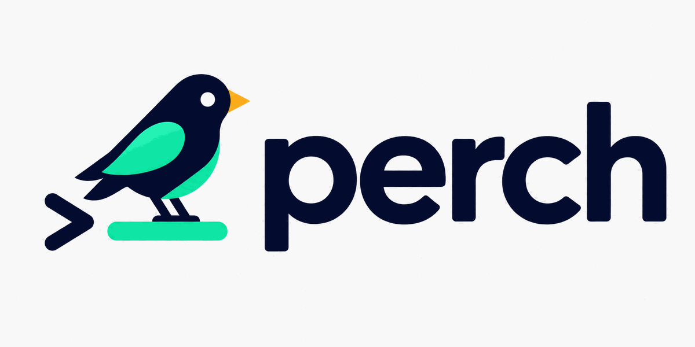

<p align="center">
  <picture>
    <source media="(prefers-color-scheme: dark)" srcset="docs/logo-dark.png">
    
  </picture>
</p>

<p align="center"><i>给 agent 项目一根栖木</i></p>

<p align="center"><a href="README.md">English</a> | <b>中文</b></p>

新开一个终端，一键回到你刚才用 **Claude Code** 或 **Codex** 工作过的项目——
可以顺手把 agent 重新拉起来，甚至直接续接上一次对话。

`perch` **零配置**：它直接读取两个 agent 自己留在磁盘上的会话历史
（`~/.claude.json` + `~/.claude/projects`、`~/.codex/sessions`），装好的那一刻，
你用 agent 打开过的每个项目就都在一次按键之外了。


## 安装

```sh
brew install --cask baoyudu/tap/perch   # macOS
# 或从源码安装：
go install github.com/baoyudu/perch/cmd/perch@latest
```

在 shell 的 rc 文件里加一行：

```sh
eval "$(perch init zsh)"     # ~/.zshrc
eval "$(perch init bash)"    # ~/.bashrc
perch init fish | source     # ~/.config/fish/config.fish
```

然后在任何终端里输入 **`p`**。

> **由 `psw` 更名而来**（≤ v0.4.0）：首次运行时旧的 `~/.config/psw`
> 会自动复制到 `~/.config/perch`（原文件不动）。只需把 rc 文件里的
> eval 行换成上面的新写法，并执行
> `brew uninstall --cask psw && brew install --cask baoyudu/tap/perch`。

## 按键

| 按键 | 动作 |
|---|---|
| 直接输入 | 模糊过滤项目（匹配名称和路径） |
| `Tab` / `Shift+Tab` | 循环切换来源：全部 → claude → codex |
| `Enter` | 项目的默认动作（全局默认：仅 `cd`） |
| `^O` | 仅 `cd` |
| `^A` | `cd` + 启动 **claude** |
| `^X` | `cd` + 启动 **codex** |
| `^R` | `cd` + **续接**上次会话（`claude --continue` / `codex resume <id>`） |
| `^S` | 置顶 / 取消置顶 |
| `^T` | 在 `projects_dir` 下新建项目 |
| `^E` | 设置页（默认动作、图标集、项目位置） |
| `→` | 聚焦预览栏：`↑↓`/`jk` 滚动，`←`/`Esc` 返回 |
| `↑↓` `^P^N` `^K^J` | 上下移动 |
| `Esc` / `^C` | 取消 |

列表里显示每个项目最近使用的 agent、相对时间、git 分支和脏文件数；
预览栏展示上次对话的结尾，帮你想起停在了哪里。`Tab` 可以只看有
claude 或 codex 会话的项目——面板标题会变色提示当前范围。

图标默认使用 [Nerd Font](https://www.nerdfonts.com) 字形；终端字体
没打补丁的话，在 `[ui]` 下设置 `icons = "plain"` 即可。

## 配置

可选，位于 `~/.config/perch/config.toml`：

```toml
# 顶层键必须写在任何 [table] 之前
ignore = ["**/.worktrees/**", "**/.claude/worktrees/**", "**/.claude-worktrees/**", "**/node_modules/**"]

[defaults]
action = "cd"          # Enter 的动作：cd | claude | codex | resume
command = "p"          # shell 函数的名字
projects_dir = "~/Code" # ^T 新建项目的位置
claude_args = []       # 每次启动 claude 附加的参数
codex_args = []        # 每次启动 codex 附加的参数

[ui]
icons = "nerd"         # "nerd"（默认，需要 Nerd Font）| "plain"

[projects."/Users/you/Code/my-app"]
action = "claude"      # 在这个项目里 Enter 意味着：cd + claude
args = ["--dangerously-skip-permissions"]
pinned = true
```

这个文件很少需要手动编辑：在选择器里按 `^E` 打开设置页即可修改常用选项。
它会原位编辑 `config.toml`，且只动自己管理的那几个键——注释、格式和文件里
的其他内容都逐字节保留。`^S` 切换的置顶属于运行时状态，存放在
`~/.config/perch/state.json`。

## 命令

| 命令 | 用途 |
|---|---|
| `perch init <zsh\|bash\|fish>` | 输出 shell 包装函数 |
| `perch pick` | 交互式选择器（由包装函数调用） |
| `perch list [--json]` | 输出合并后的项目列表 |
| `perch pin <path>` / `perch unpin <path>` | 从命令行管理置顶 |
| `perch doctor` | 检查数据源、依赖二进制和 shell 集成 |

## 工作原理

子进程无法改变父 shell 的工作目录，所以 `perch pick` 把 TUI 渲染到
`/dev/tty`，并向 stdout 输出两行——选中的目录和要执行的命令（`-` 表示
无）。`perch init` 生成的小函数负责真正的 `cd` 和启动。Codex 的会话元
数据会增量索引到 `~/.cache/perch/`，保证启动始终瞬时。

## 许可证

MIT
